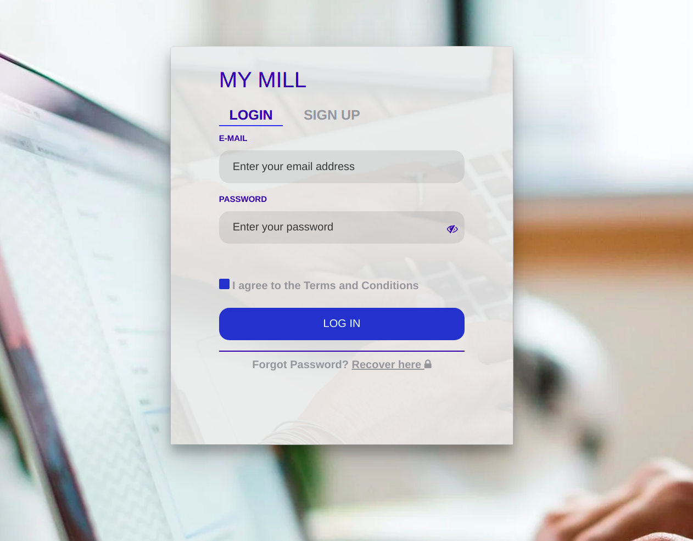

# Creating a user login UI

# Requirements
1. Vue.js
2. Node.js
   
# Workflow
- Using the Vue CLI
- Creating reusable components
- Setting up routing with Vue Router
- Styling with Bootstrap and Css


[Click for the demo](https://vuejs-login-app-with-bootstrap.netlify.app/)



## Project setup
```
npx @vue/cli create your-app-name
```

### Compiles and hot-reloads for development
```
npm run serve
```

### Compiles and minifies for production
```
npm run build
```

### Lints and fixes files
```
npm run lint
```

### Customize configuration
See [Configuration Reference](https://cli.vuejs.org/config/).
